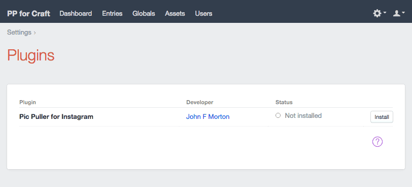

# Pic Puller for Instagram Documentation

## Overview

**Pic Puller for Instagram** helps you create your _own_ Instagram application that will live within your Craft CMS installation. I then lets your Craft users authorize your site via oAuth to access their Instagram media. (There is an *ExpressionEngine* version of Pic Puller available at [https://devot-ee.com/add-ons/pic-puller-for-instagram](https://devot-ee.com/add-ons/pic-puller-for-instagram "Pic Puller for Instagram - Expression Engine").)

Pic Puller provides Craft tags for you to access media from Instagram and includes a field type that allows authorized users to browse their personal media stream on Instagram and/or search the entire set of images and videos on Instagram by tag.

---

### Getting help

If you run into any problems, please drop a line at john@johnfmorton.com and mention "Pic Puller for Craft" in the subject line and I'll get back to you ASAP. 

I'm always interested in how people use Pic Puller, too. If you send your URL to me, I'd love to see it.

Thanks - John

---

### Version History

* Version 1.4.0 (June 5, 2015)
	- Improved "media_recent" and "user". Passing in an Instgram ID in the 'ig_user_id' parameter will allow you to pull another user's *public* feed. 
* Version 1.3.4 (April 24, 2015)
	- Changed CURL cache options to address some users receiving time out errors when accessing Instagram feed.
	- Improved the Authenticated User screen in Pic Puller to display the Instagram account info for the authorized account. This should help users spot when previoulsy working oAuth tokens are deauthorized by Instagram.
* Version 1.3.3 (March 23, 2015)
	- Fixed errors present in "free" and "client" versions of Craft seen when devMode was set to true. Now settings page of Pic Puller will only display list of admins for shared oAuth when using pro version of Craft.
* Version 1.3.2 (March 12, 2015)
	- The Instagram feed has removed "webiste" from all but the user API call. The "website" value has been removed from Pic Puller as well since it is no longer available.
* Version 1.3.1 (Dec 6, 2014)
	- Fixed various array syntax instances for compatibility with PHP 5.3
	- Fixed error in "Lastest Instagram Image" widget that would cause errors when Instagram app was not authorized with Instagram
	- Fixed PHP 5.3 issue where plugin name change was not saved to database
* Version 1.3.0 (Dec 2, 2014)
	- Added new setting allowing a single Instagram authorization by an admin to be shared across all uses in the Pic Puller settings
	- Fixed field type JSON error generated by image captions that included line breaks
* Version 1.2.2 (Nov 24, 2014)
	- Fixed error in field type where JSON data wasn't being defined as JSON in header
* Version 1.2.1 (Nov 13, 2014)
	- Initial release for sale
	- Fixed issue where customized plug in names being blank did not default to the full name of the plug in.
	- Cleaned up documentation
* Version 1.2 RC (Nov 9, 2014)
	- Release candidate
* Version 1.1 (beta)
	- Initial release of Pic Puller

---

### How to install Pic Puller for Instagram

Copy the "picpuller" directory to your Craft site in the plugins directory. The path to that direction should be "craft/plugins/". Next, log into your Craft control panel and visit the Settings page and select *"Plugins"*. You should see *"Pic Puller for Instagram"* listed among your plugins. You will need to click the "Install" button to the right of the line. Once installed, Pic Puller's status should be *"Enabled"*.

Once installed, you will see *"Pic Puller for Instagram"* added to the top-level navigation in your control panel. Select "Pic Puller for Instagram" from the top-level navigation. (Note, you can change this to a shorter name in the settings. See **Pic Puller Options** at the end of this document.)

### Creating your Instagram application

You should now see the Pic Puller control panel with 3 sections: *Set Up*, *Active App Info* & *Authorized Users*.

In the *Set Up* section, follow the onscreen instructions to set up your Instagram application.

Here is the basic workflow. Pic Puller will take you to Instagram to set up an application. Pic Puller provides you with an oAuth url that Instagram will ask for. Once the application is created within the Instagram developer area, you will take the Client ID and Client Secret provided by Instagram put them into the Pic Puller Set Up screen and save them.

You can then authorize your new Instagram application to access your Instagram media.

### Multiple users and Pic Puller for Instagram

You are not limited to one user with Pic Puller. If you have purchased the "Craft Client" or "Craft Pro" package, i.e. the paid version of Craft, other users can also authorize their Instagram accounts as well. Pic Puller works without a the upgraded Craft CMS client but is limited to the one user granted by that version of the Craft software.

A multiuser site can have each user display their own personal media on the site. When using the Pic Puller for Instagram Image Browser the user stream search will be of the individual user's Instagram stream.

It's important to realize that any "Admin" level user will be able to alter and delete the Pic Puller application.

Users that have not been granted "Admin" rights within Craft can still access Pic Puller as long as you have granted them access under the "Users" tab. This can be done on a one-by-one basis under the "Users" tab, or on a more global scale if you set up User Groups and provide the group access to Pic Puller. These non-admin users will only have the ability to authorize and unauthorize your app with an Instagram account. They will not be able to change or delete the app.

Multiple Craft user account can authorize with a single Instagram account without any trouble.

### Optional behavior for multiple users

As described above, the default behavior of Pic Puller for Instagram is for each Craft user to authenticate their Craft account with their Instagram account. 

As of version 1.3.0, in the plugin-in settings panel, you can override this behavior and have a single oAuth authorization be shared amongst all users of the Craft site. The scenario this is most likely to be used in is a company site that has many site editors, but only a single Instagram account for the organization. Choosing to use a shared oAuth authorization requires that the site developer choose a single user as the master Instagram account holder on the site. This user must be an Admin. This selection is made from the plugin settings panel. 

Only the selected account holder will see the "Pic Puller for Instagram" menu item in the global navigation. This is the menu that allows a user to create and manage the Instagram application and authorization. 

Tip: If your Instagram account holder in your organization is not someone who would typically have an admin level account to your site, one suggestion is to create a user account this is an admin level account whose only role is the creation and authorization of the Instagram application. You can then have the Instagram account holder log into this account once to have them create and authorize the application. Under normal circumstances you could have them use their regular account to contribute to the site.

### Pic Puller Image Browser Fieldtype

The Pic Puller Image Browser field type lets you browse an authorized user's media stream and/or search all of Instagram's public images by a tag.

When setting up a Pic Puller select "Pic Puller for Instagram" from the Field Type dropdown.

You will also have options that will affect how the field type will function for users who are creating entries. You can choose to let them search from their own media stream, let them use the just the search functionality, or give them access to both types of search.

**What the field type does.**

The field type searches Instagram to retrieve a media ID for an image or video uploaded through Instagram. The media ID is stored in the Craft database. The media file is not stored within your site. 

The media ID is used in conjunction with the media by ID function in your templates to show media on your site. (See the **Media by ID** section of the documentation below.)

## Working with Pic Puller for Instagram in your templates

There are 7 different template functions available with Pic Puller.

### Popular Photos on Instagram

*craft.picpuller.popular*

Description: Get a list of what media is most popular at the moment.

Instragram docs page for this function: [http://instagram.com/developer/endpoints/media/#get_media_popular](http://instagram.com/developer/endpoints/media/#get_media_popular "Instagram documentation for get_media_popular")

#### Required parameters

*none*

#### Optional parameters

limit: an integer indicating how many images to request from Instagram. Instagram may return fewer under some circumstances. Maximum of 32 allowed by Instagram.

use_stale_cache: BOOLEAN, either TRUE or FALSE (defaults to TRUE if undefined), to have Pic Puller use previously cached data returned in the event of an error in retrieving new data

**Tags returned in a successful Craft loop:**

status: a BOOLEAN of TRUE (1) is returned when Instagram media data is returned, even if it is cached data

type: returns a string "image" or "video"

media_id: the Instagram unique media ID for the image or video

created_time: time stamp of image creation time, Unix timestamp formatted

link: URL of the images homepage on Instagram

caption: The caption provided by the author. Note, it may be left untitled which will return an empty string.

thumbnail: URL to image, sized 150x150

low_resolution: URL to image, sized 306x306

standard_resolution: URL to image, sized 612x612

video_low_resolution: URL to video, sized 480x480

video_standard_resolution: URL to video, sized 640x640

latitude: latitude data, if available

longitude: longitude data, if available

username: the Instagram username of the user whose account the image is from

full_name: the full name provided by the user whose account the image is from

profile_picture: URL to the profile image of the user

error_type: a string of "NoError" to indicate a successful call to the Instagram API
resulting in valid data OR a string of "NoCodeReturned" indicating there was no data returned from Instagram

error_message: a string describing the error

#### Tags returned in an unsuccessful Craft loop:

status: a BOOLEAN of FALSE (0) is returned when no data is returned from Instagram or there is no cache data to return

error_type: a single code word indicating the type of error (NoInstagramApp, MissingReqParameter, UnauthorizedUser issued by Pic Puller. Other codes are passed through from Instagram.)

error_message: a string describing the error

#### Example template code:

	
		
			
Status: {{ instagramdata.status }}

			
Error Type: {{ instagramdata.error_type }}

			
Error Message: {{ instagramdata.error_message }}

			

		
        
caption: {{ instagramdata.caption }}

        
type: {{ instagramdata.type }}

        
cacheddata: {{ instagramdata.cacheddata }}

        

 
	

### User information

*craft.picpuller.user*

Description: Get basic information about a user.

Instragram docs page for this function:
[http://instagram.com/developer/endpoints/users/#get_users](http://instagram.com/developer/endpoints/users/#get_users "Instagram documentation for get_users")

#### Required parameters

user_id: the Craft user id (not an Instagram user id). Using the Craft user id *without* the **optional** 'ig_user_id' parameter will return the authorized user's Instagram user data.

#### Optional parameters

ig_user_id: you can pass in the Instagram user id of another user and retrieve that user's *public* user information data (How do you retrieve a user's ID? Try [this site](http://www.otzberg.net/iguserid/ 'Find an Instagram User').)

use_stale_cache: BOOLEAN, either TRUE or FALSE (defaults to TRUE if undefined), to have Pic Puller use previously cached data returned in the event of an error in retrieving new data

**Tags returned in a successful Craft loop:**

status: a BOOLEAN of TRUE (1) is returned when Instagram media data is returned, even if it is cached data

username: the Instagram username

id: the Instagram user id

bio: biography information provided by the Instagram user

profile_picture: URL to the profile image of the user

full_name: the full name provided by the user on Instagram

counts_media: the total number of images in this user’s Instagram feed

counts_followed_by: the number of users who follow this user on Instagram

counts_follows: the number of users this user follows on Instagram

website: the website URL provided by the user whose account the image is from

error_type: a string of "NoError" to indicate a successful call to the Instagram API

resulting in valid data OR a string of "NoCodeReturned" indicating there was no data returned from Instagram

error_message: a string describing the error

#### Tags returned in an unsuccessful Craft loop:

status: a BOOLEAN of FALSE (0) is returned when no data is returned from Instagram or there is no cache data to return

error_type: a single code word indicating the type of error (NoInstagramApp, MissingReqParameter, UnauthorizedUser issued by Pic Puller. Other codes are passed through from Instagram.)

error_message: a string describing the error

#### Example template code:

	
		
Status: {{ instagramdata.status }}

		
			
username: {{ instagramdata.username }}

			
full_name: {{ instagramdata.full_name }}

			
profile_picture:

			

			
counts_media: {{ instagramdata.counts_media }}

		
			
Error Type: {{ instagramdata.error_type }}

			
Error Message: {{ instagramdata.error_message }}

		
	

### User feed

*craft.picpuller.user_feed*

Description: See the authenticated user’s feed. Includes user photos and photos of other users the select user follows in single feed.

Instragram docs page for this function:
[http://instagram.com/developer/endpoints/users/#get_users_feed](http://instagram.com/developer/endpoints/users/#get_users_feed "Instagram documentation for get_users_feed")

#### Required parameters

user_id: This is the ID number of an Craft user. (It is not the Instagram user id number.)

#### Optional parameters

limit: an integer indicating how many images to request from Instagram. Instagram may return fewer under some circumstances. Maximum of 32 allowed by Instagram.

use_stale_cache: BOOLEAN, either TRUE or FALSE (defaults to TRUE if undefined), to have Pic Puller use previously cached data returned in the event of an error in retrieving new data

max_id: an integer used to determine pagination of results. (See next_max_id in the ‘Tags returned’ below section for more information.)

**Tags returned in a successful Craft loop:**

status: a BOOLEAN of TRUE (1) is returned when Instagram media data is returned, even if it is cached data

type: returns a string "image" or "video"

media_id: the Instagram unique media ID for the image or video

created_time: time stamp of image creation time, Unix timestamp formatted

link: URL of the images homepage on Instagram

caption: The caption provided by the author. Note, it may be left untitled which will return an empty string.

thumbnail: URL to image, sized 150x150

low_resolution: URL to image, sized 306x306

standard_resolution: URL to image, sized 612x612

video_low_resolution: URL to video, sized 480x480

video_standard_resolution: URL to video, sized 640x640

latitude: latitude data, if available

longitude: longitude data, if available

next_max_id: an integer, provided by Instagram, used to return the next set in the same series of images.
Pass this value into the max_id parameter of the loop to get the next page of results.

user_id: the Instagram user ID of the user whose account the image is from

username: the Instagram username of the user whose account the image is from

profile_picture: URL to the profile image of the user

full_name: the full name provided by the user whose account the image is from

error_type: a string of "NoError" to indicate a successful call to the Instagram API resulting in valid data OR a string of "NoCodeReturned" indicating there was no data returned from Instagram

error_message: a string describing the error

#### Tags returned in an unsuccessful Craft loop:

status: a BOOLEAN of FALSE (0) is returned when no data is returned from Instagram or there is no cache data to return

error_type: a single code word indicating the type of error (NoInstagramApp, MissingReqParameter, UnauthorizedUser issued by Pic Puller. Other codes are passed through from Instagram.)

error_message: a string describing the error

#### Example template code:

	
		
			
Status: {{ instagramdata.status }}

			
Error Type: {{ instagramdata.error_type }}

			
Error Message: {{ instagramdata.error_message }}

			

		
		
			
Loop Index: {{ loop.index }}

			

			
caption: {{instagramdata.caption}}

			
created_time: {{ instagramdata.created_time }}

		
			
Error Type: {{ instagramdata.error_type }}

			
Error Message: {{ instagramdata.error_message }}

		
	

### Recent media

*craft.picpuller.media_recent*

Description: Get the most recent media published by a user.

Instragram docs page for this function: [http://instagram.com/developer/endpoints/users/#get_users_media_recent](http://instagram.com/developer/endpoints/users/#get_users_media_recent "Instagram documentation for get_users_media_recent")

#### Required parameters

user_id: This is the ID number of an Craft user. (It is not the Instagram user id number.) Using the Craft user id *without* the **optional** 'ig_user_id' parameter will return the authorized user's Instagram recent media.

#### Optional parameters

ig_user_id: you can pass in the Instagram user id of another user and retrieve that user's *public* media (How do you retrieve a user's ID? Try [this site](http://www.otzberg.net/iguserid/ 'Find an Instagram User').)

limit: an integer indicating how many images to request from Instagram. Instagram may return fewer under some circumstances. Maximum of 32 allowed by Instagram.

use_stale_cache: BOOLEAN, either TRUE or FALSE (defaults to TRUE if undefined), to have Pic Puller use previously cached data returned in the event of an error in retrieving new data

max_id: an integer used to determine pagination of results. (See next_max_id in the ‘Tags returned’ below section for more information.)

**Tags returned in a successful Craft loop:**

status: a BOOLEAN of TRUE (1) is returned when Instagram media data is returned, even if it is cached data

type: returns a string "image" or "video"

media_id: the Instagram unique media ID for the image or video

created_time: time stamp of image creation time, Unix timestamp formatted

link: URL of the images homepage on Instagram

caption: The caption provided by the author. Note, it may be left untitled which will return an empty string.

thumbnail: URL to image, sized 150x150

low_resolution: URL to image, sized 306x306

standard_resolution: URL to image, sized 612x612

video_low_resolution: URL to video, sized 480x480

video_standard_resolution: URL to video, sized 640x640

latitude: latitude data, if available

longitude: longitude data, if available

next_max_id: an integer, provided by Instagram, used to return the next set in the same series of images. Pass this value into the max_id parameter of the loop to get the next page of results.

error_type: a string of "NoError" to indicate a successful call to the Instagram API resulting in valid data OR a string of "NoCodeReturned" indicating there was no data returned from Instagram

error_message: a string describing the error

#### Tags returned in an unsuccessful Craft loop:

status: a BOOLEAN of FALSE (0) is returned when no data is returned from Instagram or there is no cache data to return

error_type: a single code word indicating the type of error (NoInstagramApp, MissingReqParameter, UnauthorizedUser issued by Pic Puller. Other codes are passed through from Instagram.)

error_message: a string describing the error

#### Example template code:

	
		
			
Status: {{ instagramdata.status }}

			
Error Type: {{ instagramdata.error_type }}

			
Error Message: {{ instagramdata.error_message }}

			

		
		
		
Loop Index: {{ loop.index }}

		
			
THERE IS VIDEO HERE!

			
{{ instagramdata.video_low_resolution }}

		
		

		
caption: {{instagramdata.caption}}

		
created_time: {{ instagramdata.created_time }}

		
			
Error Type: {{ instagramdata.error_type }}

			
Error Message: {{ instagramdata.error_message }}

		
	

### Liked image feed

*craft.picpuller.user_liked*

Description: See the authenticated user’s list of media they’ve liked. Note that this list is ordered by the sequence in which the user liked the media. Private media is returned as long as the authenticated user has permission to view that media. Liked media lists are only available for the authenticated user.

Instragram docs page for this function: [http://instagram.com/developer/endpoints/users/#get_users_liked_feed](http://instagram.com/developer/endpoints/users/#get_users_liked_feed "Instagram documentation for get_users_liked_photos")

#### Required parameters

user_id: This is the ID number of an Craft user. (It is not the Instagram user id number.)

#### Optional parameters

limit: an integer indicating how many images to request from Instagram. Instagram may return fewer under some circumstances. Maximum of 32 allowed by Instagram.

use_stale_cache: BOOLEAN, either TRUE or FALSE (defaults to TRUE if undefined), to have Pic Puller use previously cached data returned in the event of an error in retrieving new data

max_id: an integer used to determine pagination of results. (See next_max_id in the ‘Tags returned’ below section for more information.)

**Tags returned in a successful Craft loop:**

status: a BOOLEAN of TRUE (1) is returned when Instagram media data is returned, even if it is cached data

type: returns a string "image" or "video"

media_id: the Instagram unique media ID for the image or video

created_time: time stamp of image creation time, Unix timestamp formatted

link: URL of the images homepage on Instagram

caption: The caption provided by the author. Note, it may be left untitled which will return an empty string.

thumbnail: URL to image, sized 150x150

low_resolution: URL to image, sized 306x306

standard_resolution: URL to image, sized 612x612

video_low_resolution: URL to video, sized 480x480

video_standard_resolution: URL to video, sized 640x640

latitude: latitude data, if available

longitude: longitude data, if available

next_max_id: an integer, provided by Instagram, used to return the next set in the same series of images. Pass this value into the max_id parameter of the loop to get the next page of results.

username: the Instagram username of the user whose account the image is from

full_name: the full name provided by the user whose account the image is from

profile_picture: URL to the profile image of the user

user_id: the Instagram user ID of the user whose account the image is from

error_type: a string of "NoError" to indicate a successful call to the Instagram API resulting in valid data OR a string of "NoCodeReturned" indicating there was no data returned from Instagram

error_message: a string describing the error

#### Tags returned in an unsuccessful Craft loop:

status: a BOOLEAN of FALSE (0) is returned when no data is returned from Instagram or there is no cache data to return

error_type: a single code word indicating the type of error (NoInstagramApp, MissingReqParameter, UnauthorizedUser issued by Pic Puller. Other codes are passed through from Instagram.)

error_message: a string describing the error

#### Example template code:

	
	    
			
Status: {{ instagramdata.status }}

			
Error Type: {{ instagramdata.error_type }}

			
Error Message: {{ instagramdata.error_message }}

			

		
		
			
Loop Index: {{ loop.index }}

			

			
caption: {{instagramdata.caption}}

			
created_time: {{ instagramdata.created_time }}

		
			
Error Type: {{ instagramdata.error_type }}

			
Error Message: {{ instagramdata.error_message }}

		
	

### Media by tag

*craft.picpuller.tagged_media*

Description:
Get a list of recently tagged media. Note that this media is ordered by when the media was tagged with this tag, rather than the order it was posted.

For consistency amongst the tags used in Pic Puller, the Craft tags use ‘next_max_id’ for pagination. If you refer to the Instagram documentation, you will see references ‘max_tag_id’ is used for pagination. That does not apply to Pic Puller. Those tags are rewritten by the module to be ‘next_max_id’.

Instragram docs page for this function: [http://instagram.com/developer/endpoints/tags/#get_tags_media_recent]
(http://instagram.com/developer/endpoints/tags/#get_tags_media_recent "Instagram documentation for get_tags_media_recent")

#### Required parameters

user_id: This is the ID number of an Craft user. (It is not the Instagram user id number.)

#### Optional parameters

limit: an integer indicating how many images to request from Instagram. Instagram may return fewer under some circumstances. Maximum of 32 allowed by Instagram.

use_stale_cache: BOOLEAN, either TRUE or FALSE (defaults to TRUE if undefined), to have Pic Puller use previously cached data returned in the event of an error in retrieving new data

max_id: an integer used to determine pagination of results. (See next_max_id in the ‘Tags returned’ below section for more information.)

**Tags returned in a successful Craft loop:**

status: a BOOLEAN of TRUE (1) is returned when Instagram media data is returned, even if it is cached data

type: returns a string "image" or "video"

media_id: the Instagram unique media ID for the image or video

created_time: time stamp of image creation time, Unix timestamp formatted

link: URL of the images homepage on Instagram

caption: The caption provided by the author. Note, it may be left untitled which will return an empty string.

thumbnail: URL to image, sized 150x150

low_resolution: URL to image, sized 306x306

standard_resolution: URL to image, sized 612x612

video_low_resolution: URL to video, sized 480x480

video_standard_resolution: URL to video, sized 640x640

latitude: latitude data, if available

longitude: longitude data, if available

next_max_id: an integer, provided by Instagram, used to return the next set in the same series of images. Pass this value into the max_id parameter of the loop to get the next page of results.

user_id: the Instagram user ID of the user whose account the image is from

username: the Instagram username of the user whose account the image is from

profile_picture: URL to the profile image of the user

full_name: the full name provided by the user whose account the image is from

error_type: a string of "NoError" to indicate a successful call to the Instagram API resulting in valid data OR a string of "NoCodeReturned" indicating there was no data returned from Instagram

error_message: a string describing the error

#### Tags returned in an unsuccessful Craft loop:

status: a BOOLEAN of FALSE (0) is returned when no data is returned from Instagram or there is no cache data to return

error_type: a single code word indicating the type of error (NoInstagramApp, MissingReqParameter, UnauthorizedUser issued by Pic Puller. Other codes are passed through from Instagram.)

error_message: a string describing the error

#### Example template code:

	
		
			
Status: {{ instagramdata.status }}

			
Error Type: {{ instagramdata.error_type }}

			
Error Message: {{ instagramdata.error_message }}

			

		
		
			
Loop Index: {{ loop.index }}

			

			
caption: {{instagramdata.caption}}

			
type: {{ instagramdata.type }}

			
created_time: {{ instagramdata.created_time }}

		
			
Error Type: {{ instagramdata.error_type }}

			
Error Message: {{ instagramdata.error_message }}

		
	

### Media by ID

*craft.picpuller.media*

Description: Get information about a single media object.

Instragram docs page for this function: [http://instagram.com/developer/endpoints/media/#get_media](http://instagram.com/developer/endpoints/media/#get_media "Instagram documentation for get_media")

#### Required parameters

user_id: This is the ID number of an Craft user. (It is not the Instagram user id number.)

media_id: this is the ID number that Instagram has assigned to an image or video

#### Optional parameters

use_stale_cache: BOOLEAN, either TRUE or FALSE (defaults to TRUE if undefined), to have Pic Puller use previously cached data returned in the event of an error in retrieving new data

**Tags returned in a successful Craft loop:**

status: a BOOLEAN of TRUE (1) is returned when Instagram media data is returned, even if it is cached data

created_time: time stamp of image creation time, Unix timestamp formatted

link: URL of the images homepage on Instagram

caption: The caption provided by the author. Note, it may be left untitled which will return an empty string.

thumbnail: URL to image, sized 150x150

low_resolution: URL to image, sized 306x306

standard_resolution: URL to image, sized 612x612

video_low_resolution: URL to video, sized 480x480

video_standard_resolution: URL to video, sized 640x640

latitude: latitude data, if available

longitude: longitude data, if available

username: the Instagram username of the user whose account the image is from

user_id: the Instagram user id of the user whose account the image is from

full_name: the full name provided by the user whose account the image is from

profile_picture: URL to the profile image of the user

website: the website information whose account the image is from, if available

likes: number of likes for piece of media

error_type: a string of "NoError" to indicate a successful call to the Instagram API resulting in valid data OR a string of "NoCodeReturned" indicating there was no data returned from Instagram

error_message: a string describing the error

#### Tags returned in an unsuccessful Craft loop:

status: a BOOLEAN of FALSE (0) is returned when no data is returned from Instagram or there is no cache data to return

error_type: a single code word indicating the type of error (NoInstagramApp, MissingReqParameter, UnauthorizedUser issued by Pic Puller. Other codes are passed through from Instagram.)

error_message: a string describing the error

#### Example template code:

	
		
			
Status: {{ instagramdata.status }}

			
Error Type: {{ instagramdata.error_type }}

			
Error Message: {{ instagramdata.error_message }}

			

		
		
			
username: {{ instagramdata.username }}

			
full_name: {{ instagramdata.full_name }}

			

			
caption: {{instagramdata.caption}}

			
created_time: {{ instagramdata.created_time }}

		
			
Error Type: {{ instagramdata.error_type }}

			
Error Message: {{ instagramdata.error_message }}

		
	

### Pic Puller Options

#### Control Panel Widget

Pic Puller includes a control panel widget that displays the most recent image from an authorized user's Instagram feed. It is added on a per user basis to the Dashboard home screen in the control panel.

#### Customize the plug in name

Seeing "Pic Puller for Instagram" in your global navigation can be a longer than you may want. You can easily customize the name to be much shorter. You'll need to be an Admin to do this. It will affect all users.

Click the gear icon and go to the Plugins page within the control panel.

Now click the name of the plugin, Pic Puller for Instagram.

Change it to whatever you like, "PP", "Pic Puller" or even just "Instagram". Then click Save. You will see the change immediately. If you leave the name blank, it will default back to the full name of the plugin.

### Notes on the Instagram API

#### API Limitations

The Instagram API is wonderful but it's not an all access pass into Instagram. There are many limits placed on the API. Here are a few that many people ask about in regard to Pic Puller.

##### Rate limits

Instagram limits the number of requests an application can make per hour. There are a variety of different limits. See [http://instagram.com/developer/limits/](http://instagram.com/developer/limits/ "Instagram developer documentation on API limits") for the full details. Pic Puller attempts to help you not care about these limits by caching every response you receive from Instagram. That means if you hit the limit on an especially busy day on a page that includes your Instagram feed, instead of displaying the error message from Instagram, your Craft template will render the _last successful feed_ for that call to the Instagram API. When the time limit has passed, it will start using the live feed from Instagram again. In addition to the caching supplied by the Pic Puller plugin, please use [Craft's built in template caching tags](http://buildwithcraft.com/docs/templating/cache "Craft documentation on caching"). Using the 2 in combination should keep your site running smoothly. For example, cache your template for at least 10 minutes at a time and it's likely you'll never exceed your Instagram API limit. 

##### No complex queries

The most common question received is around complex search queries. The short answer is that the Instagram API doesn't support them and therefore Pic Puller doesn't offer them. For example, the tag search allows for searching by a single tag only and only from the full Instagram set of media. You can't search for 2 tags or limit your search to a select set of accounts.  There are come clever workarounds in certain situations. If you'd like to discuss those, please drop me a line at john@johnfmorton.com. 

##### Unexpected number of images returned

The number of images returned from a Pic Puller loop can be up to 32 images in most cases, but it's not guaranteed. Why is that? It has to do with how the Instagram API returns data. Although I've not read it in official documentation, it appears whatever number of images you request are returned from the API and then that set of images is filtered for images that may have been deleted by users. For example, if I were pulling 3 images from my Instagram feed, I would expect 3 images returned in my Pic Puller loop in Craft. If I went into my Instagram app on my phone and deleted the most recent photo I've taken, I would then only receive 2 images back in my Craft site. 

##### Unexpected order of images

Order of images can be unexpected on Instagram. Tagged images are not ordered by when they were posted, but by when the tag was added to the image. Liked images are ordered also ordered by when they were liked, not when they were posted. 