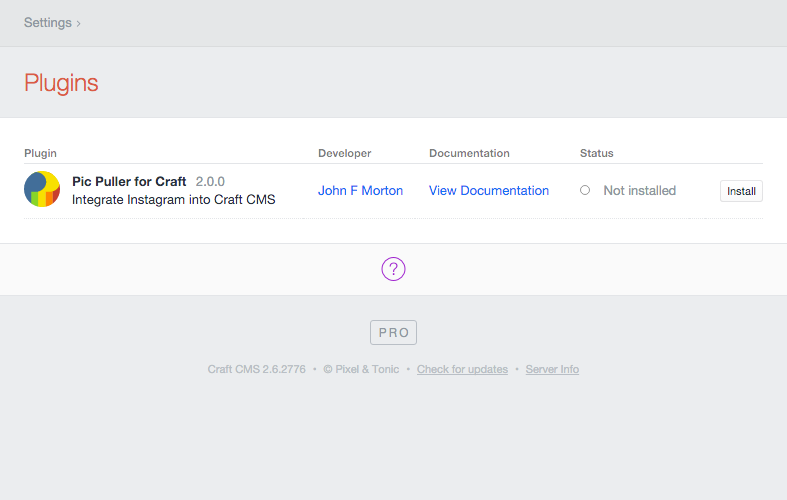
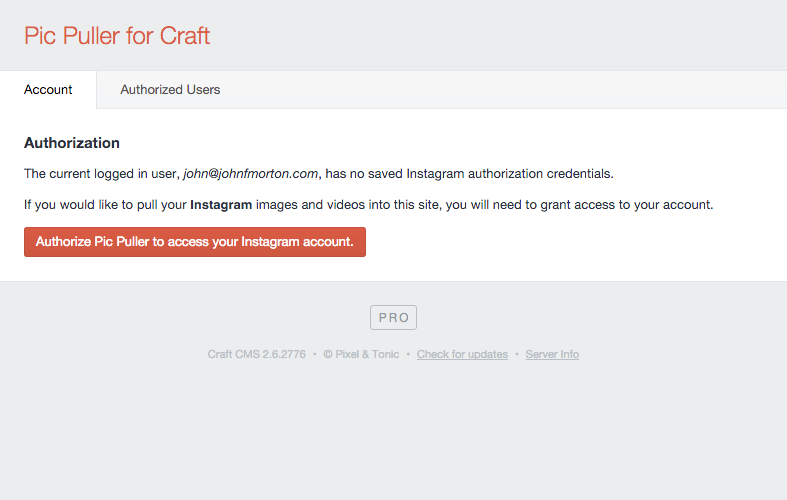
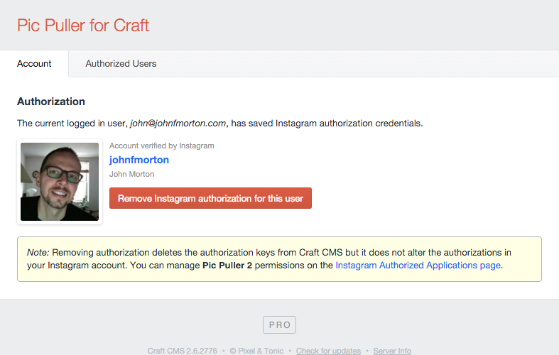
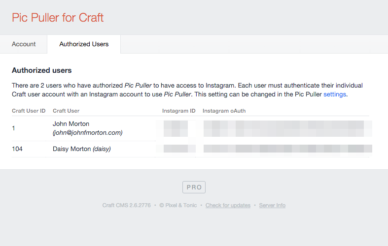
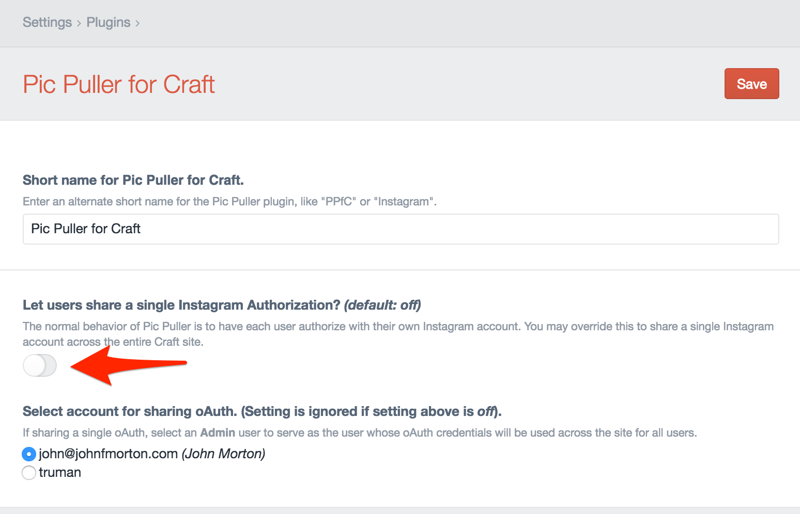
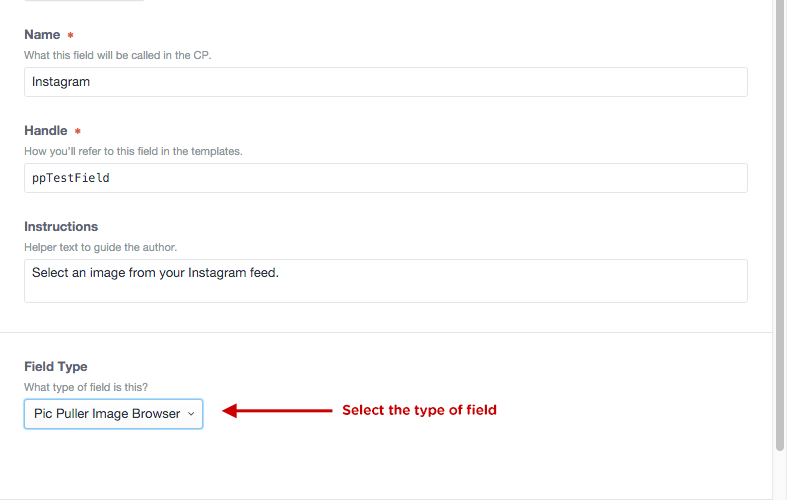
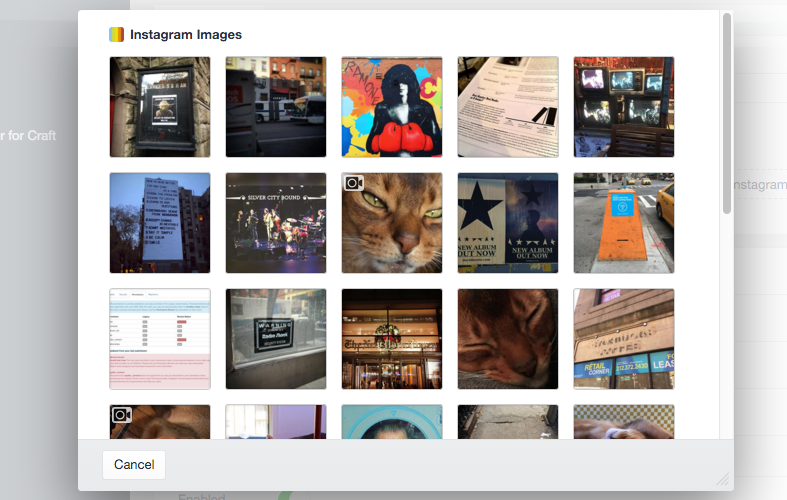
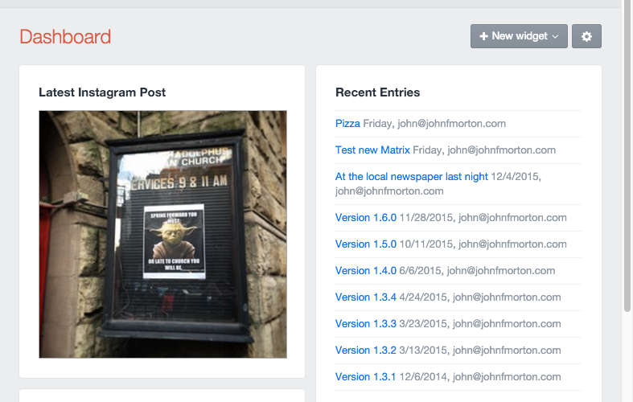
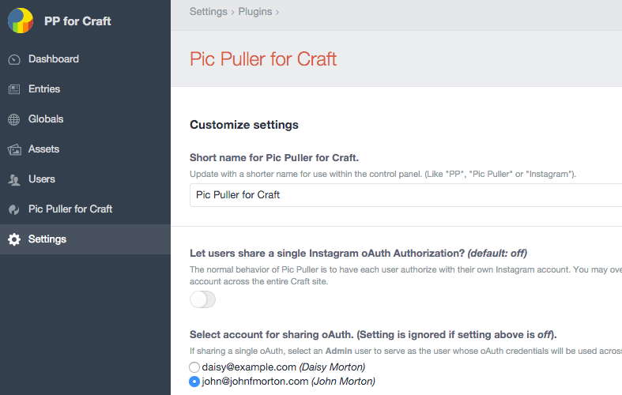
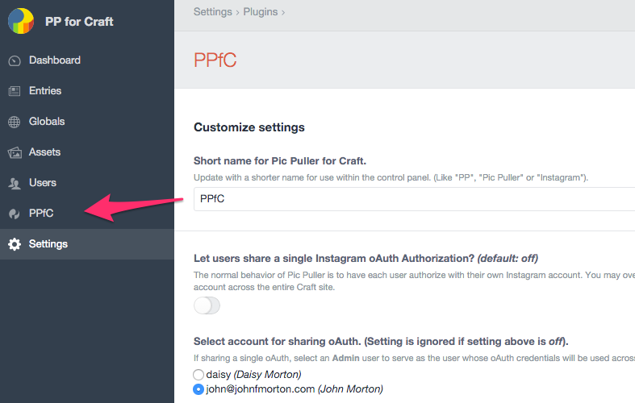

# Pic Puller for Craft v2 Documentation

## Overview

**Pic Puller for Craft v2** is a plug in for Craft CMS that lets authorized users pull in their Instagram media into Craft.

Pic Puller provides native Craft tags to access Instagram media in templates. It also includes a field type that allows authorized users to browse their personal media stream on Instagram.

## What's new in version 2

**Pic Puller for Craft v2** is a significantly different plugin from version 1. 

In late 2015, Instagram dramatically scaled back access to their API. Instagram now requires approval of all apps that attempt to use their API. Instagram would not approve any versions of Pic Puller 1 apps that users had created.

After clarifying what would be permissible and not with the Instagram team, Pic Puller 2's API access has now been approved. Happily, Craft now has access to Instagram again with Pic Puller v2. 

All instances of the Pic Puller plugin now use this new Instagram-approved API access. 

## Limitations

The API access that Pic Puller 2 has is limited compared to version 1. Basically, a user is limited to accessing only their own content. There is not access available to other user's public content.

Pic Puller version 1 allowed you as a developer to authorize using your personal account and then enter in the Instagram ID of your client to pull their media. This access is no longer permitted by Instagram. Your client will be required to authorize the Pic Puller app with their Instagram credentials. 

There is no "tag" searching available, even for tags in your own media. I'm still trying to make a case for this, but so far this access is restricted to "select" partners.

### Getting help

If you run into any problems using Pic Puller, please drop a line at john@johnfmorton.com and mention "Pic Puller for Craft support" in the subject line and I'll get back to you ASAP. 

I'm always interested in how people use Pic Puller. If you send your URL to me, I'd love to see it.

Thanks - John

### Shameless plug

If you don't already subscribe to **Craft Link List**, please check it out at [http://craftlinklist.com](#). It's free and will keep you up-to-date on the latest links from the Craft community. 

### Version History

* Version 2.3.1 (June 27, 2016)
    - [Fixed] Fixed 404 errors on the settings page.
* Version 2.3.0 (June 21, 2016)
    - [Fixed] Added back the unintentionally deleted "shared authorization" feature of Pic Puller. You can now share one Admin user's Instagram Authorization across all users of your site.
* Version 2.2.0 (May 25, 2016)
    - [Added] Pic Puller now supports [CSRF Protection](https://craftcms.com/support/csrf-protection), an optional security setting in Craft CMS, when making a request for Instagram access.
* Version 2.1.0 (April 11, 2016)
    - [Added] New "caption_only" variable has been added to "media_recent" and "media" (by ID) functions. It will eliminate captions that are stuffed with hashtags from being so damn ugly.
    - [Added] New "tags" variable has been added to "media_recent" and "media" (by ID) functions. This is an array of the tags associated with a piece of media.
    - [Improved] The fieldtype talked too much in the console. It has had a stern talking to about this and will now be quiet. 
* Version 2.0.0 (March 10, 2016)
    - [Improved] Pic Puller 2 is released
    - [Improved] Instagram authorization is for the **Pic Puller 2** application on Instagram
    - [Fixed]Access limited to an authorized Instagram user's media instead of the full scope of public media on Instagram as was the case in version 1 of Pic Puller
* Version 1.6.0 (Nov 28, 2015)
    - [Updated] Instagram has removed the Popular Feed from their API and it has now been removed from Pic Puller. See: http://developers.instagram.com/post/133424514006/instagram-platform-update for more information.
    - [Updated] Instagram has removed the User Feed from their API and it has now been removed from Pic Puller. This is the feed you see in the Instagram app on your phone, **not** the *media\_recent* feed of images taken by a single user.
    - [Updated] Pic Puller has been updated for Craft 2.5 with new icons, links to the online documentation.
    - [Improved] Some of the language in the app has been updated for clarity.
* Version 1.5.0 (Oct 11, 2015)
    - [Improved] An API change from Instagram allowing for non-square images and videos to be posted added height and width values to data it returns to developers. This data has been added to Pic Puller. See: http://developers.instagram.com/post/128288227716/api-migration-for-landscape-and-portrait-formats for more information.
    - [IMPROVED] Added the low bandwidth video information to Pic Puller. Look for *video\_low\_bandwidth*, *video\_low\_bandwidth\_width* and *video\_low\_bandwidth\_height* in the documentation.
* Version 1.4.0 (June 5, 2015)
    - Improved "media\_recent" and "user". Passing in an Instagram ID in the 'ig\_user\_id' parameter will allow you to pull another user's *public* feed.
* Version 1.3.4 (April 24, 2015)
    - Changed CURL cache options to address some users receiving time out errors when accessing Instagram feed.
    - Improved the Authenticated User screen in Pic Puller to display the Instagram account info for the authorized account. This should help users spot when previously working oAuth tokens are deauthorized by Instagram.
* Version 1.3.3 (March 23, 2015)
    - Fixed errors present in "free" and "client" versions of Craft seen when devMode was set to true. Now settings page of Pic Puller will only display list of admins for shared oAuth when using pro version of Craft.
* Version 1.3.2 (March 12, 2015)
    - The Instagram feed has removed "webiste" from all but the user API call. The "website" value has been removed from Pic Puller as well since it is no longer available.
* Version 1.3.1 (Dec 6, 2014)
    - Fixed various array syntax instances for compatibility with PHP 5.3
    - Fixed error in "Lastest Instagram Image" widget that would cause errors when Instagram app was not authorized with Instagram
    - Fixed PHP 5.3 issue where plugin name change was not saved to database
* Version 1.3.0 (Dec 2, 2014)
    - Added new setting allowing a single Instagram authorization by an admin to be shared across all uses in the Pic Puller settings
    - Fixed field type JSON error generated by image captions that included line breaks
* Version 1.2.2 (Nov 24, 2014)
    - Fixed error in field type where JSON data wasn't being defined as JSON in header
* Version 1.2.1 (Nov 13, 2014)
    - Initial release for sale
    - Fixed issue where customized plug in names being blank did not default to the full name of the plug in.
    - Cleaned up documentation
* Version 1.2 RC (Nov 9, 2014)
    - Release candidate
* Version 1.1 (beta) (Nov 4, 2014)
    - Initial beta release of Pic Puller

### How to install Pic Puller for Craft

Copy the "picpuller" directory to your Craft site in the plugins directory. The path to that directory should be "craft/plugins/". Next, log into your Craft control panel and visit the Settings page and select *"Plugins"*. You should see *"Pic Puller for Craft"* listed among your plugins. You will need to click the "Install" button to the right of the line. Once installed, Pic Puller's status should be *"Enabled"*.

Once installed, you will see *"Pic Puller for Craft"* added to the global-level navigation in your control panel. Select "Pic Puller for Craft" from the navigation. (Note, you can change this to a shorter name in the settings. See **Pic Puller Options** at the end of this document.)

### Authorizing with Instagram 

To authorize a Craft site to pull in Instgram media, a user must allow this access. After installing Pic Puller, the site will ask for authorization.

Once authorization has been granted, Pic Puller will display the authorized user's credentials.

### Multiple users and Pic Puller for Craft

You are not limited to one user with Pic Puller. If you have purchased the "Craft Client" or "Craft Pro" package, i.e. the paid version of Craft, additional users can also authorize their Instagram accounts. Pic Puller works without a the paid Craft CMS version but is limited to the one user allowed by that version of the Craft software.

A multiuser site can have each user display their own personal media on the site. When using the Pic Puller Image Browser the user stream search will be from each authorized user's Instagram stream.

Any "Admin" level user can view the list of authorized Pic Puller users along with their Instagram oAuth key for the Pic Puller 2 application. Basically, you need to trust other Admins in your Craft site.

Users that have not been granted "Admin" rights within Craft can still access the Pic Puller plugin page as long as you have granted them access under the "Users" tab. Access can be granted on a one-by-one basis under the "Users" tab, or on a broader scale if you set up User Groups and provide the group access to Pic Puller. 

These non-admin users will have the ability to authorize and de-authorize Pic Puller with an Instagram account. Non-admin users will not be able to see the list of authorized users across the entire Craft site.

### Optional behavior for multiple users

As described above, the default behavior of Pic Puller for Craft is for each Craft user to authenticate their Craft account with their Instagram account. 

You can override this default behavior and have a single oAuth authorization be shared amongst all users of the Craft site. The most likely scenario for this feature is of a company site that has many site editors, but only a single Instagram account across the organization. Choosing to use a single Instagram authorization requires that the site developer choose a single user as the master Instagram account holder on the site. **This user must be an Admin.** The selection of the master Instagram user is made from the Pic Puller settings panel. 

Only the selected account holder will see the "Pic Puller for Craft" menu item in the global navigation. This is the menu that allows a user to create and manage the Instagram application and authorization. 

Tip: If your Instagram account holder in your organization is not someone who would typically have an admin level account to the site, one suggestion is to create an admin level account to be used solely for authorization purposes. You can have the Instagram account holder log into this account *once* to have them authorize Pic Puller to access the corporate Instagram account. Under everyday circumstances you could have them use their regular "editor" account to contribute to the site.

### Pic Puller Image Browser Field type

The Pic Puller Image Browser field type lets an authorized user browse their Instagram media stream and select media for use in a Craft entry.

When setting up a field select "Pic Puller Image Browser" from the Field Type dropdown.

The field type searches Instagram to retrieve a media ID for an image or video uploaded through Instagram. A small video icon in the upper lefthand corner designates that the piece of media is a video rather than an image.

The media ID is stored in the Craft database. The media file is not stored within your site as dictated by the Instagram API agreement.

The media ID is used in conjunction with the media by ID function in your templates to show media on your site. (See the **Media by ID** section of the documentation below.)

## Working with Pic Puller for Craft in your templates

### Caching of Pic Puller requests & Instagram rate limits

Although Pic Puller does not store Instagram media, it does cache the JSON data that is returned from successful Instagram API requests. 

Instagram limits the number of requests that can be made to it's API endpoints. See [https://www.instagram.com/developer/limits/](https://www.instagram.com/developer/limits/) for the full details. These limits reset every hour, but exhausting the allotted requests could result in your site not having the Instagram media you expect.

If you use the `use_stale_cache` parameter set to `true` in your Pic Puller tags, the cached JSON data will be used when Instagram does not deliver valid data back from a request. 

Pic Pullers's JSON caching does not replace Craft's own [caching tags](https://craftcms.com/docs/templating/cache "Craft CMS  docs"). You should also use Craft's own caching in your templates.

## Template functions

There are 3 template functions available with Pic Puller.

### User information

*craft.picpuller.user*

Description: Get basic information about a user.

Instagram docs page for this function:
[https://www.instagram.com/developer/endpoints/users/#get\_users](https://www.instagram.com/developer/endpoints/users/#get_users "Instagram documentation for get_users")

#### Required parameters

user\_id: the Craft user id (*not* an Instagram user id)

#### Optional parameters

use\_stale\_cache: BOOLEAN, either TRUE or FALSE (defaults to TRUE if undefined), to have Pic Puller use previously cached data returned in the event of an error in retrieving new data

**Tags returned in a successful Craft loop:**

status: a BOOLEAN of TRUE (1) is returned when Instagram media data is returned, *even if it is cached data*

username: the Instagram username

id: the Instagram user id

bio: biography information provided by the Instagram user

profile\_picture: URL to the profile image of the user

full\_name: the full name provided by the user on Instagram

counts\_media: the total number of images in this user’s Instagram feed

counts\_followed\_by: the number of users who follow this user on Instagram

counts\_follows: the number of users this user follows on Instagram

website: the website URL provided by the user whose account the image originates from

error\_type: a string of "NoError" to indicate a successful call to the Instagram API resulting in valid data

error\_message: a string describing the *lack* of an error being returned

#### Tags returned in an unsuccessful Craft loop:

status: a BOOLEAN of FALSE (0) is returned when no data is returned from Instagram or there is no cache data to return

error\_type: a single code word indicating the type of error ("MissingReqParameter", "UnauthorizedUser", "NoCodeReturned" issued by Pic Puller. Other error codes are passed through from Instagram.)

error\_message: a string describing the error

#### Example template code:

    
        
status: {{ instagramdata.status }}

        
cacheddata: {{ instagramdata.cacheddata }}

        
            
username: {{ instagramdata.username }}

            
full_name: {{ instagramdata.full_name }}

            
profile_picture:

            

            
counts_media: {{ instagramdata.counts_media }}

        
            
Error Type: {{ instagramdata.error_type }}

            
Error Message: {{ instagramdata.error_message }}

        
    

### Recent media

*craft.picpuller.media\_recent*

Description: Get the most recent media published by a user.

Instagram docs page for this function: [https://www.instagram.com/developer/endpoints/users/#get\_users\_media\_recent](https://www.instagram.com/developer/endpoints/users/#get_users_media_recent "Instagram documentation for get_users_media_recent")

#### Required parameters

user\_id: the Craft user id (*not* an Instagram user id)

#### Optional parameters

limit: an integer indicating how many images to request from Instagram. Instagram may return fewer under some circumstances (See *Unexpected number of images returned* in the FAQ at the of this document). Maximum of 32 allowed by Instagram.

use\_stale\_cache: BOOLEAN, either TRUE or FALSE (defaults to TRUE if undefined), to have Pic Puller use previously cached data returned in the event of an error in retrieving new data

max\_id: an integer used to determine pagination of results. (See next\_max\_id in the ‘Tags returned’ below section for more information.)

**Tags returned in a successful Craft loop:**

status: a BOOLEAN of TRUE (1) is returned when Instagram media data is returned, even if it is cached data

type: returns a string "image" or "video"

media\_id: the Instagram unique media ID for the image or video

created\_time: time stamp of image creation time, Unix timestamp formatted

link: URL of the media' page on Instagram

caption: the caption provided by the author. Note, it may be left untitled which will return an empty string.

caption_only: the caption provided by the author *minus* any content starting with the first hashtag. For example, if the caption were "Digging into Craft CMS. #craftcms #code #fun", the caption_only function would return "Digging into Craft CMS."

tags: an array of the tags associated with the media

thumbnail: URL to image

thumbnail\_width: width of image in pixels.

thumbnail\_height: height of image in pixels. 

low\_resolution: URL to image

low\_resolution\_width: width of image in pixels.

low\_resolution\_height: height of image in pixels.

standard\_resolution: URL to image

standard\_resolution\_width: width of image in pixels.

standard\_resolution\_height: height of image in pixels. 

video\_low\_bandwidth: URL to video

video\_low\_bandwidth\_width: width of video in pixels.

video\_low\_bandwidth\_height: height of video in pixels.

video\_low\_resolution: URL to video

video\_low\_resolution\_width: width of video in pixels.

video\_low\_resolution\_height: height of video in pixels.

video\_standard\_resolution: URL to video

video\_standard\_resolution\_width: width of video in pixels.

video\_standard\_resolution\_height: height of video in pixels.

latitude: latitude data, if available

longitude: longitude data, if available

next\_max\_id: an integer, provided by Instagram, used to return the next set in the same series of images. Pass this value into the max\_id parameter of the loop to get the next page of results.

error\_type: a string of "NoError" to indicate a successful call to the Instagram API resulting in valid data 

error\_message: a string describing the *lack* of an error being returned

#### Tags returned in an unsuccessful Craft loop:

status: a BOOLEAN of FALSE (0) is returned when no data is returned from Instagram or there is no cache data to return

error\_type: a single code word indicating the type of error ("MissingReqParameter", "UnauthorizedUser", "NoCodeReturned" issued by Pic Puller. Other error codes are passed through from Instagram.)

error\_message: a string describing the error

#### Example template code:

    
        
            
Status: {{ instagramdata.status }}

            
Error Type: {{ instagramdata.error_type }}

            
Error Message: {{ instagramdata.error_message }}

            

        
        
        
Loop Index: {{ loop.index }}

        
            
This is a video; not an image.

            
{{ instagramdata.video_low_resolution }}

        
        

        
caption: {{instagramdata.caption}}

        
created_time: {{ instagramdata.created_time }}

        
            
Error Type: {{ instagramdata.error_type }}

            
Error Message: {{ instagramdata.error_message }}

        
    

### Media by ID

*craft.picpuller.media*

Description: Get information about a single media object.

Instragram docs page for this function: [https://www.instagram.com/developer/endpoints/media/#get_media](https://www.instagram.com/developer/endpoints/media/#get_media "Instagram documentation for get_media")

#### Required parameters

user_id: This is the ID number of an Craft user. (It is not the Instagram user id number.)

media_id: this is the ID number that Instagram has assigned to an image or video

#### Optional parameters

use_stale_cache: BOOLEAN, either TRUE or FALSE (defaults to TRUE if undefined), to have Pic Puller use previously cached data returned in the event of an error in retrieving new data

**Tags returned in a successful Craft loop:**

status: a BOOLEAN of TRUE (1) is returned when Instagram media data is returned, even if it is cached data

created_time: time stamp of image creation time, Unix timestamp formatted

link: URL of the images homepage on Instagram

caption: The caption provided by the author. Note, it may be left untitled which will return an empty string.

caption_only: the caption provided by the author *minus* any content starting with the first hashtag. For example, if the caption were "Digging into Craft CMS. #craftcms #code #fun", the caption_only function would return "Digging into Craft CMS."

tags: an array of the tags associated with the media_id

thumbnail: URL to image

thumbnail_width: width of image in pixels.

thumbnail_height: height of image in pixels. 

low_resolution: URL to image

low_resolution_width: width of image in pixels.

low_resolution_height: height of image in pixels.

standard_resolution: URL to image

standard_resolution_width: width of image in pixels.

standard_resolution_height: height of image in pixels. 

video_low_bandwith: URL to video

video_low_bandwith_width: width of video in pixels.

video_low_bandwith_height: height of video in pixels.

video_low_resolution: URL to video

video_low_resolution_width: width of video in pixels.

video_low_resolution_height: height of video in pixels.

video_standard_resolution: URL to video

video_standard_resolution_width: width of video in pixels.

video_standard_resolution_height: height of video in pixels.

latitude: latitude data, if available

longitude: longitude data, if available

username: the Instagram username of the user whose account the image originates from

user_id: the Instagram user id of the user whose account the image originates from

full_name: the full name provided by the user whose account the image originates from

profile_picture: URL to the profile image of the user

likes: number of likes for piece of media

error_type: a string of "NoError" to indicate a successful call to the Instagram API resulting in valid data 

error_message: a string describing the error

#### Tags returned in an unsuccessful Craft loop:

status: a BOOLEAN of FALSE (0) is returned when no data is returned from Instagram or there is no cache data to return

error_type: a single code word indicating the type of error ("MissingReqParameter", "UnauthorizedUser", "NoCodeReturned" issued by Pic Puller. Other error codes are passed through from Instagram.)

error_message: a string describing the error

#### Example template code:

    
        
            
Status: {{ instagramdata.status }}

            
Error Type: {{ instagramdata.error_type }}

            
Error Message: {{ instagramdata.error_message }}

            

        
        
            
username: {{ instagramdata.username }}

            
full_name: {{ instagramdata.full_name }}

            

            
caption: {{instagramdata.caption}}

            
created_time: {{ instagramdata.created_time }}

        
            
Error Type: {{ instagramdata.error_type }}

            
Error Message: {{ instagramdata.error_message }}

        
    

### Pic Puller Options

#### Control Panel Widget

Pic Puller includes a control panel widget that displays the most recent image from an authorized user's Instagram feed. It is added on a per user basis to the Dashboard home screen in the control panel.

#### Customize the plug in name

You can easily customize the name "Pic Puller for Craft" to be shorter. You'll need to be an Admin to do this. It will affect all users.

Click the gear icon and go to the Plugins page within the control panel.

Now click the name of the plugin, Pic Puller for Craft.

Change it to whatever you like "PPfC", Pic Puller" or even just "Instagram". Then click Save. You will see the change immediately. If you leave the name blank, it will default back to the full name of the plugin.

### FAQs

#### Unexpected number of images returned

The number of images returned from a Pic Puller loop can be up to 32 images in most cases, but it's not guaranteed. Why is that? It has to do with how the Instagram API returns data. Although I've not read it in official documentation, it appears whatever number of images you request are returned from the API and then that set of images is filtered for images that may have been deleted by users. For example, if I were pulling 3 images from my Instagram feed, I would expect 3 images returned in my Pic Puller loop in Craft. If I went into my Instagram app on my phone and deleted the most recent photo I've taken, I would then only receive 2 images back in my Craft site. 

#### When will tag searching return to Pic Puller?

Unfortunately I'm skeptical that Instagram will approve the return of this feature. I will continue to lobby Instagram for increased access to their API. 